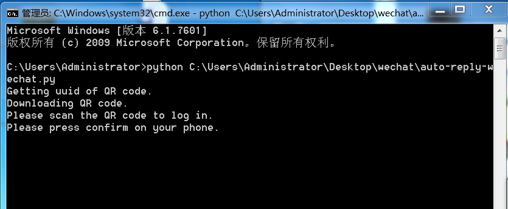
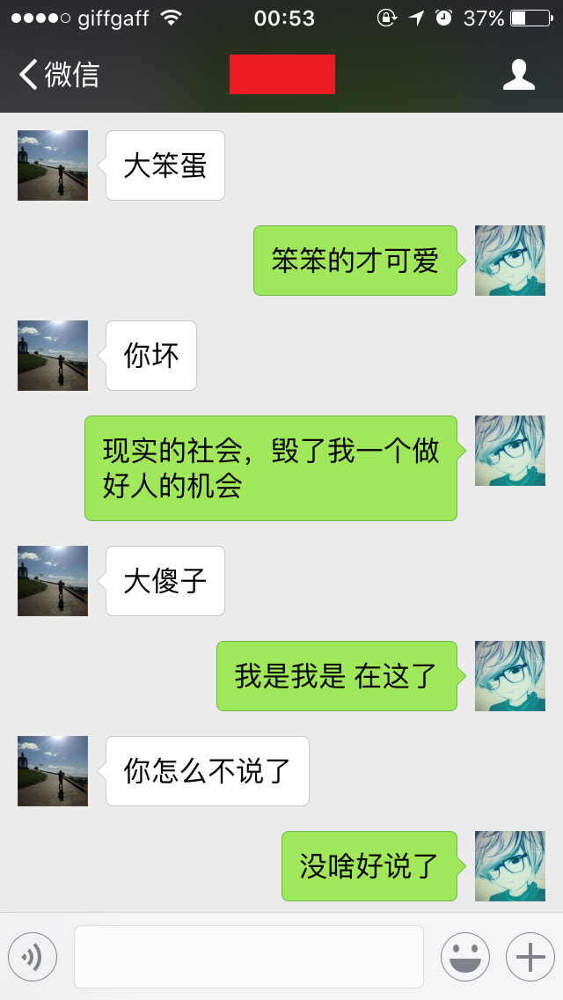

# 微信自动回复功能

## 如何使用？
 1.安装python2.7  
 
 2.安装python pip
 
 3.安装相关模块  
```
$ pip install itchat
$ pip install requests
$ pip install time
$ pip install re
$ pip install sys
$ pip install urllib2
$ pip install urllib
$ pip install json
```
4.运行模块  
```
python auto-reply-wechat.py
```

5.运行成功后，电脑会弹出二维码，手机扫描登录微信  


6.登录成功后，最终的回复效果  



## 没有实现的功能？
1.图片的自动回复

2.指定人的自动回复


## 作品参考
https://gist.github.com/yfgeek/d38775aac03f3b2d7371d2bea17766d0
